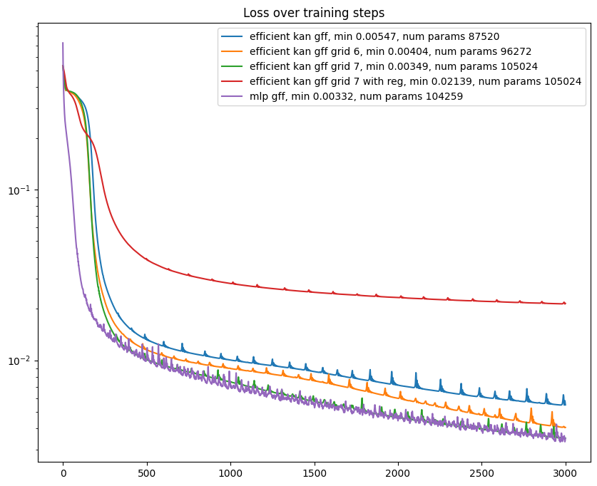

# implicit-kan

Trying to use [EfficientKAN](https://github.com/Blealtan/efficient-kan), [FastKAN](https://github.com/ZiyaoLi/fast-kan) and [ChebyKAN](https://github.com/SynodicMonth/ChebyKAN) as an implicit function to fit a 2D image below
The basic idea comes from the [Fourier Features](https://bmild.github.io/fourfeat/) paper (similar to [SIREN](https://www.vincentsitzmann.com/siren/)). An MLP or KAN takes coordinates grid as an input and learns to output an image, basically learning to complress image inside the weights. FF and SIREN papers have shown that the basic MLP is not capable to do it properly but with a certain trick (positional encoding that is used in NeRF) it suddenly can

This repo mostly aims at expanding Appendix B from the original paper

For now it looks like KANs also needs fourier features and MLP still beats KANs. More experiments are needed to verify that claim

## Loss plots

## EfficientKAN grid 5 vs EfficientKAN grid 7 vs MLP

